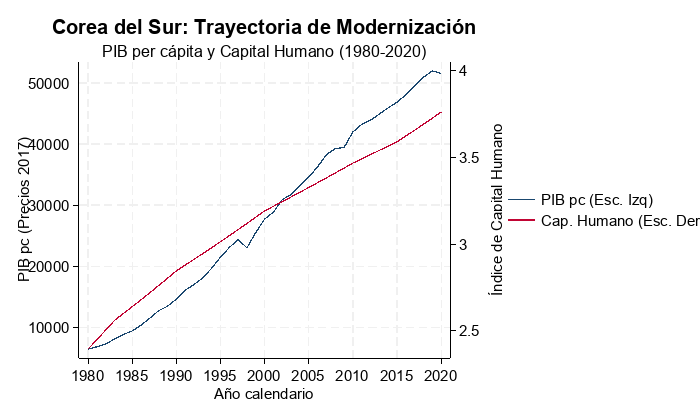
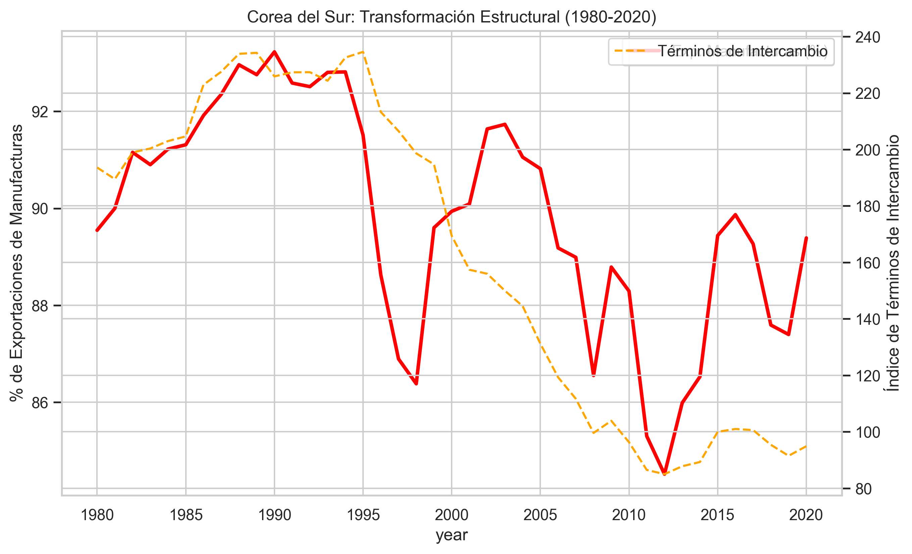

# Auditoría Económica Aplicada: Corea del Sur (1980-2020)

---

# Introducción

Esta auditoría económica examina la trayectoria de desarrollo de **Corea del Sur** durante el periodo **1980-2020**, un lapso que captura la consolidación del "Milagro del Río Han". El objetivo es contrastar la evidencia empírica con las predicciones de la **Teoría de la Modernización**, que enfatiza la acumulación de capital y el cambio cultural @ray1998development, y el **Enfoque Estructuralista**, que centra su análisis en la transformación de la estructura productiva y la superación de la dependencia mediante la industrialización con aprendizaje @fajnzylber1990industrialization.

# Evaluación desde la Teoría de la Modernización

Corea del Sur representa el caso paradigmático de una transición exitosa a través de las etapas del crecimiento de Rostow. Durante el periodo auditado, el país mostró una disciplina excepcional en la acumulación de factores productivos.

## Crecimiento Económico y Acumulación

Como se observa en la evidencia recolectada de la Penn World Table 11.0 @feenstra2015next, el PIB per cápita real mantuvo una pendiente positiva constante, resistiendo crisis externas significativas (1997 y 2008). Según @ray1998development, esta acumulación es virtuosa cuando el capital humano y físico crecen en tándem, permitiendo saltos en la productividad total de los factores.

## Dinámica Sectorial e Inversión Externa

La inversión extranjera directa (IED) jugó un papel catalizador, no solo como flujo de capital, sino como vehículo de transferencia tecnológica. Sin embargo, a diferencia de otros países en desarrollo, Corea utilizó la IED para fortalecer capacidades locales, alineándose con la visión de desarrollo sostenible de @sachs2015era.

## Capital Humano y Empleo

El índice de Capital Humano muestra un crecimiento lineal sostenido. Esta inversión pública masiva en educación permitió al país transitar de una economía de mano de obra intensiva a una basada en el conocimiento, validando la tesis de que la modernización requiere un cambio profundo en la "calidad" de la población.

## Conclusión Parcial: Trayectoria de Desarrollo

La trayectoria de Corea del Sur valida la tesis de la modernización: una secuencia progresiva de acumulación que resultó en una convergencia real con las economías avanzadas. No obstante, el éxito no fue puramente inercial, sino el resultado de una estrategia deliberada.

# Evaluación desde la Teoría Estructuralista

Desde el lente estructuralista, el éxito coreano se explica por una transformación deliberada de su matriz productiva para romper la asimetría centro-periferia planteada por @prebisch1950economic.

## Estructura Productiva y Especialización

Corea del Sur logró una diversificación sin precedentes. La participación de las manufacturas en las exportaciones alcanzó niveles superiores al 80%. Este proceso es lo que @fajnzylber1990industrialization denomina "casillero vacío" o industrialización con aprendizaje, donde el progreso técnico se difunde a toda la estructura económica.

## Términos de Intercambio y Productividad

A diferencia de otras economías periféricas, Corea del Sur mitigó el deterioro de los términos de intercambio mediante la mejora constante de la productividad industrial. Como advirtió @prebisch1950economic, sin cambio técnico, los países exportadores de bienes primarios están condenados al empobrecimiento relativo; Corea rompió esta regla mediante la sofisticación tecnológica.

## Dependencia y Tecnología en el Siglo XXI

En la actualidad, Corea enfrenta nuevos desafíos estructurales. Aunque logró soberanía tecnológica en semiconductores, la "guerra de chips" entre EE. UU. y China coloca al país en una posición vulnerable debido a su dependencia de mercados externos @imf2024korea. Además, la pérdida de competitividad frente a China en sectores como baterías y robótica sugiere que la transformación estructural debe ser un proceso permanente.

## Conclusión Parcial: Transformación Estructural

La evidencia confirma una transformación estructural profunda. Corea superó la trampa de la especialización primaria, pero hoy enfrenta una "trampa de madurez" caracterizada por un envejecimiento poblacional extremo (con la tasa de fertilidad más baja del mundo) que amenaza la sostenibilidad de su modelo productivo @ocde2025perspectivas.

# Conclusión General

La auditoría concluye que el desarrollo de Corea del Sur es un caso híbrido exitoso: utilizó los mecanismos de acumulación de la **Modernización** pero bajo una dirección de política **Estructuralista**. El país logró lo que pocos han conseguido: saltar del subdesarrollo al estatus de potencia tecnológica. Sin embargo, su futuro depende de su capacidad para resolver crisis demográficas y tensiones geopolíticas que las teorías clásicas no previeron totalmente.

# Bibliografía

::: {#refs}
:::

# Anexos

## Anexo 1: Datos y Réplica (Acceso Obligatorio)
*   **Repositorio de Datos (Nube)**: [CLICK AQUÍ PARA ACCEDER A LA CARPETA DE DATOS](https://drive.google.com/drive/folders/1AbV-5soT07P6wyLTwkeLnUUwrVEgtunL?usp=sharing)  
    *(Incluye: Excel final, Scripts de Stata y Metadatos de validación)*
*   **Archivo Excel Local**: [KOR_Audit_Data.xlsx](data/raw/KOR_Audit_Data.xlsx)
*   **Metadatos de Auditoría**: [process_metadata.json](data/raw/process_metadata.json)

## Anexo 2: Bibliografía y Evidencia (Acceso Obligatorio)
*   **Carpeta de Fuentes (Nube)**: [CLICK AQUÍ PARA ACCEDER A LA BIBLIOGRAFÍA](COLOCAR_AQUI_LINK_A_DRIVE_O_NUBE)  
    *(Incluye: PDFs de fuentes académicas con partes relevantes resaltadas: Ray, Fajnzylber, Prebisch, etc.)*
*   **Fuentes Verificables**:
    *   [World Bank Open Data](https://data.worldbank.org)
    *   [Penn World Table 11.0](https://www.rug.nl/ggdc/productivity/pwt/)
    *   [OECD Economic Outlook 2025](https://www.oecd.org)
