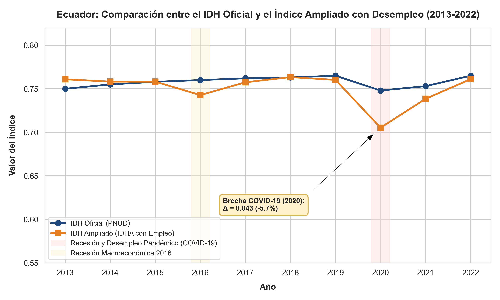

---
format:
  pdf:
    pdf-engine: xelatex
    toc: false
    number-sections: true
    colorlinks: true
    mainfont: "Times New Roman"
    fontsize: 10pt
    output-file: "IDH_Ampliado_Ecuador.pdf"
    fig-cap-location: top
    tbl-cap-location: top
    geometry:
      - margin=2.54cm
    header-includes:
      - \usepackage{setspace}
      - \setstretch{1.0}
      - \usepackage{indentfirst}
      - \setlength{\parindent}{1.27cm}
      - \setlength{\parskip}{0pt}
      - \usepackage{booktabs}
      - \usepackage{tabularx}
      - \usepackage{float}
      - \usepackage{array}
      - \usepackage{caption}
      - \captionsetup[table]{format=plain, labelsep=newline, justification=raggedright, singlelinecheck=false, labelfont={bf,normalsize}, textfont={it,normalsize}}
      - \captionsetup[figure]{format=plain, labelsep=newline, justification=raggedright, singlelinecheck=false, labelfont={bf,normalsize}, textfont={it,normalsize}}
      - \addtokomafont{disposition}{\rmfamily}
      - \addtokomafont{section}{\large\bfseries}
      - \addtokomafont{subsection}{\normalsize\bfseries}
      - \addtokomafont{subsubsection}{\normalsize\bfseries\itshape}
  html:
    toc: false
    number-sections: true
    theme: cosmo
  docx:
    toc: false
    number-sections: true
    reference-doc: "/home/erick-fcs/Documentos/universidad/07_Ciclo/septimo_ciclo/economic_development/docs/writing/templates/Plantilla presentación trabajos.docx"
bibliography: references.bib
csl: https://raw.githubusercontent.com/citation-style-language/styles/master/apa.csl
crossref:
  tbl-title: Tabla
  fig-title: Figura
---

\begin{center}
\textbf{UNIVERSIDAD NACIONAL DE LOJA} \\
Carrera de Economía \\
Desarrollo Económico \\
Séptimo A \\
Unidad 2 \\
Septiembre 2025/Febrero 2026

\vspace{1em}
\textbf{\Large Construcción de un Índice Ampliado de Desarrollo Humano para Ecuador} \\
\vspace{0.5em}
\textbf{Evaluación Multidimensional de la Seguridad Económica y la Estabilidad del Empleo (Periodo: 2013-2022)}
\end{center}

\noindent \textbf{Nombres:} Erick Fabricio Condoy Seraquive, Dayana Francelina Bustamante Benitez \hfill \textbf{Fecha:} 17 de mayo de 2026

\vspace{1.5em}

El IDH oficial @undp1990hdr asume que el ingreso refleja bienestar material. Omite la **Seguridad Económica**. Integrar la **Tasa de Desempleo (2013-2022)** corrige este vacío estructural. El desempleo constituye una privación directa de libertades reales elementales @undp2015work; superando la visión ortodoxa del mero desajuste macroeconómico coyuntural.

## Justificación Teórica y Empírica

El Enfoque de Capacidades @sen1999development advierte que el desempleo erosiona el auto-respeto y la agencia individual al constituir una privación de capacidades. Esta inestabilidad induce vulnerabilidad psicológica @stiglitz2009report, infligiendo un daño psíquico irreparable sobre la cohesión familiar @clark2003unemployment. A nivel macroeconómico, el desempleo fuerza la transición compulsiva de la juventud hacia la informalidad @ilo2022global. En Ecuador, esta exclusión laboral incrementa directamente la deserción escolar y provocó un colapso social post-pandemia drásticamente subestimado por las métricas oficiales de bienestar @esteves2020impacto.

## Datos y Fuentes

El análisis utiliza datos anuales de Ecuador (2013-2022). Las variables del IDH oficial se extrajeron del **PNUD** @undp2024hdr: (a) *esperanza de vida al nacer* (salud), (b) *años promedio de escolaridad* y *años esperados de escolaridad* (educación), y (c) *Ingreso Nacional Bruto (INB) per cápita* en paridad de poder adquisitivo (PPA en dólares constantes de 2017). La **Tasa de Desempleo Abierto ($u_t$)** (porcentaje de la población económicamente activa) provino del **Banco Mundial/OIT** @worldbank2020ecuador, capturando choques macroestructurales como la recesión petrolera (2016) y el impacto del COVID-19 (2020).

## Metodología de Cálculo

La construcción del índice adopta el método de normalización del PNUD @jahan2016measuring, adaptado a variables de privación conforme a los estándares de desarrollo humano @undp2020costarica. Al ser el desempleo una variable de privación (donde una mayor tasa indica menor bienestar), se aplica una normalización inversa para obtener el **Índice de Empleo** ($I_{Empleo, t}$), transformándolo en una métrica de logro positiva. Los umbrales normativos se definen en un $Min = 0\%$ (pleno empleo teórico como referencia ideal) y un $Max = 15\%$ (techo normativo de crisis severa). En economías en desarrollo como Ecuador, la ausencia de un seguro de desempleo universal obliga a los trabajadores a refugiarse en el subempleo informal, por lo que una tasa de desempleo abierto del $15\%$ representa un colapso estructural absoluto del mercado de trabajo, justificando este límite superior:

$$I_{Empleo, t} = \frac{Max - u_t}{Max - Min} = \frac{15\% - u_t}{15\%}$$ {#eq-1}

La agregación del Índice de Desarrollo Humano Ampliado ($IDHA_t$) se realiza mediante media geométrica, asignando una ponderación equiproporcional del $25\%$ a cada una de las cuatro dimensiones. Este método penaliza los desequilibrios entre dimensiones al asumir sustituibilidad imperfecta, impidiendo que avances en salud o educación oculten crisis de empleo @undp2020costarica:

$$IDHA_t = \left( I_{Salud, t} \times I_{Educacion, t} \times I_{Ingresos, t} \times I_{Empleo, t} \right)^{\frac{1}{4}}$$ {#eq-2}

**Limitación:** La inclusión de la dimensión de empleo con un peso del $25\%$ rompe el diseño tripartito tradicional del IDH. Aunque incrementa la sensibilidad de la métrica ante los ciclos económicos del mercado de trabajo, puede sobreestimar perturbaciones transitorias de corto plazo sobre el desarrollo humano estructural.

## Resultados e Interpretación

La integración de la dimensión de estabilidad laboral revela divergencias críticas frente al índice tradicional, evidenciadas en los datos de la @tbl-comparativa y la trayectoria de la @fig-trayectoria. Durante la recesión de 2016, mientras el IDH Oficial experimentó una subida inercial ($0.760$), el IDHA se contrajo a **$0.742$**, desvelando la insensibilidad de la métrica tradicional ante despidos masivos. Este divorcio métrico se agudizó en la crisis sanitaria de 2020 con un desplome del $5.7\%$ en el IDHA ($0.705$), lo que prueba que las variables clásicas ocultaron la pérdida real de bienestar en los hogares. Al final del periodo, en 2022, ambas curvas convergen aritméticamente ($0.761$ vs $0.765$), una paridad numérica engañosa que invisibiliza el subempleo crónico y la precarización estructural de la fuerza laboral, mostrando que el IDHA responde de manera altamente elástica a las perturbaciones reales del mercado laboral en contraste con la rigidez inercial del IDH oficial.

\begingroup
\footnotesize

| Año ($t$) | Salud ($I_{Salud}$) | Edu. ($I_{Edu}$) | Ingreso ($I_{Ing}$) | Desemp. ($u_t$) | Empleo ($I_{Emp}$) | IDH Ofic. | IDHA |
|:---:|:---:|:---:|:---:|:---:|:---:|:---:|:---:|
| **2013** | 0.869 | 0.690 | 0.704 | 3.08% | 0.795 | 0.750 | **0.760** |
| **2014** | 0.874 | 0.695 | 0.709 | 3.48% | 0.768 | 0.755 | **0.758** |
| **2015** | 0.877 | 0.700 | 0.709 | 3.62% | 0.759 | 0.758 | **0.758** |
| **2016** | 0.878 | 0.705 | 0.709 | 4.60% | 0.693 | 0.760 | **0.742** |
| **2017** | 0.880 | 0.708 | 0.710 | 3.84% | 0.744 | 0.762 | **0.757** |
| **2018** | 0.882 | 0.710 | 0.709 | 3.53% | 0.765 | 0.763 | **0.763** |
| **2019** | 0.882 | 0.713 | 0.712 | 3.81% | 0.746 | 0.765 | **0.760** |
| **2020** | 0.800 | 0.712 | 0.735 | 6.13% | 0.591 | 0.748 | **0.705** |
| **2021** | 0.812 | 0.715 | 0.735 | 4.55% | 0.697 | 0.753 | **0.738** |
| **2022** | 0.871 | 0.720 | 0.714 | 3.76% | 0.749 | 0.765 | **0.761** |
: Trayectoria comparativa del IDH Oficial frente al Índice Ampliado en Ecuador. {#tbl-comparativa}

\endgroup

\vspace{-1.5em}
\noindent {\footnotesize \textit{Nota.} Elaboración propia con datos del PNUD (2024) y Banco Mundial/OIT (2022).}

{#fig-trayectoria width=60%}

\vspace{-1.5em}
\noindent {\footnotesize \textit{Nota.} Elaboración propia con datos del PNUD (2024) y Banco Mundial/OIT (2022) de los años 2013 a 2022. El eje de las ordenadas (Y) representa el valor del índice en una escala normalizada de 0 a 1, donde valores superiores indican un mayor nivel de bienestar multidimensional.}

## Política Pública Recomendada

Para salvaguardar las libertades evaluadas @sen1999development, urgen tres intervenciones estructurales: 1) Rediseñar el Seguro de Desempleo (IESS) como transferencia activa, condicionada a programas de reconversión laboral (SECAP), vinculando la asistencia pasiva a políticas activas de inserción laboral @kluve2016what; 2) Subsidios a nómina para primer empleo joven, supeditados a retención mínima de 24 meses para mitigar la cicatrización laboral @ilo2022global; 3) Estabilizadores automáticos mediante financiamiento y alivio fiscal para Pymes ante recesiones, condicionados a no ejecutar despidos @heredia2021analisis, bloqueando la migración compulsiva hacia la supervivencia informal @arellano2021determinantes.

## Bibliografía

::: {#refs}
:::

## Anexos

### Enlace de la Carpeta Digital Compartida 

[Carpeta Digital Compartida - Evidencia Científica y Datos](https://drive.google.com/drive/folders/1TSY1tdASor8RpizbIoGGRecUWFzK74F0?usp=sharing)

