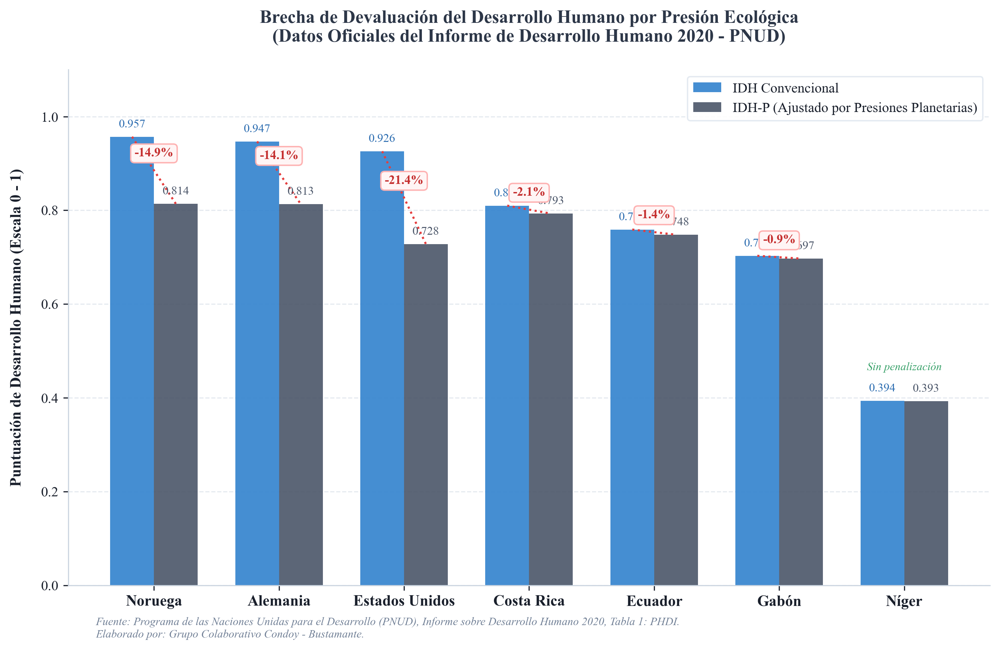

---
format:
  pdf:
    pdf-engine: xelatex
    toc: false
    number-sections: true
    colorlinks: true
    mainfont: "Times New Roman"
    fontsize: 10pt
    output-file: "Participacion_2_Perfilado_Seccion.pdf"
    fig-cap-location: top
    tbl-cap-location: top
    geometry:
      - margin=2.54cm
    header-includes:
      - \usepackage{setspace}
      - \setstretch{1.0}
      - \usepackage{indentfirst}
      - \setlength{\parindent}{1.27cm}
      - \setlength{\parskip}{0pt}
      - \usepackage{booktabs}
      - \usepackage{tabularx}
      - \usepackage{float}
      - \usepackage{array}
      - \usepackage{caption}
      - \captionsetup[table]{format=plain, labelsep=newline, justification=raggedright, singlelinecheck=false, labelfont={bf,normalsize}, textfont={it,normalsize}}
      - \captionsetup[figure]{format=plain, labelsep=newline, justification=raggedright, singlelinecheck=false, labelfont={bf,normalsize}, textfont={it,normalsize}}
      - \addtokomafont{disposition}{\rmfamily}
      - \addtokomafont{section}{\large\bfseries}
      - \addtokomafont{subsection}{\normalsize\bfseries}
      - \addtokomafont{subsubsection}{\normalsize\bfseries\itshape}

bibliography: references.bib
csl: https://raw.githubusercontent.com/citation-style-language/styles/master/apa.csl
crossref:
  tbl-title: Tabla
  fig-title: Figura
---

\begin{center}
\textbf{UNIVERSIDAD NACIONAL DE LOJA} \\
Carrera de Economía \\
Desarrollo Económico \\
Séptimo A \\
Unidad 2 \\
Septiembre 2025/Febrero 2026

\vspace{1em}
\textbf{\Large Participación 2: Perfilado de Sección y Análisis de Indicadores de Desarrollo Humano} \\
\vspace{0.5em}
\textbf{Análisis de Nuevas Fronteras y Brechas de Género: IDH-P e IDG}
\end{center}

\noindent \textbf{Nombres:} Erick Fabricio Condoy Seraquive, Dayana Francelina Bustamante Benitez \hfill \textbf{Fecha:} 19 de mayo de 2026

\vspace{1.5em}

# Introducción y Fundamentos Teóricos

La evaluación del desarrollo económico experimentó una ruptura epistemológica fundamental con la introducción del enfoque de capacidades [@sen1999development]. Este paradigma desplaza la métrica convencional de acumulación de bienes y crecimiento del Producto Interno Bruto (PIB) hacia las libertades reales de los individuos. El bienestar no se define por la opulencia material. Se define por la capacidad de agencia. Bajo este marco, conceptualizado por Amartya Sen y Mahbub ul Haq, la política pública adquiere un fin ético directo: expandir el abanico de opciones de vida que las personas tienen razones para valorar [@sen1999development].

El Enfoque de las Capacidades opera mediante dos pilares conceptuales complementarios:
* **Funcionamientos (*Functionings*):** Los logros materiales e inmateriales que una persona efectivamente realiza o experimenta [@sen1999development]. Van desde condiciones básicas, como la seguridad nutricional y la ausencia de morbilidad evitable, hasta estados complejos como la integración comunitaria y el autorrespeto.
* **Capacidades (*Capabilities*):** La libertad sustantiva del sujeto. Representa la combinación total de funcionamientos que son físicamente factibles y socialmente viables de elegir.

La diferencia es crucial para el análisis distributivo. El funcionamiento es el estado alcanzado; la capacidad es el espacio de libertad de elección de donde proviene dicho estado. Medir esta libertad sustantiva exige superar la ceguera de los promedios nacionales agregados. El Programa de las Naciones Unidas para el Desarrollo (PNUD) responde a este desafío a través del diseño de métricas globales complejas [@pnud2020hdr]. Este estudio examina las dos fronteras críticas de esta suite de indicadores: el Índice de Desarrollo Humano ajustado por Presiones Planetarias (IDH-P) y el Índice de Desigualdad de Género (IDG) [@pnud2020hdr; @pnud2010hdr].

# Análisis de Indicadores de Nuevas Fronteras y Brechas de Género

## Índice de Desarrollo Humano ajustado por Presiones Planetarias (IDH-P)

### Concepto y el Contexto del Antropoceno
El Antropoceno define la era geológica actual, caracterizada por una presión de origen humano que amenaza la estabilidad y resiliencia de los sistemas biofísicos terrestres. Ignorar este límite ambiental distorsiona cualquier estimación de progreso de largo plazo. En 2020, el PNUD introdujo el Índice de Desarrollo Humano ajustado por Presiones Planetarias (IDH-P) para internalizar formalmente esta frontera ecológica [@pnud2020hdr]. El IDH-P devalúa de forma multiplicativa el logro de los países que sostienen su nivel de vida a través de una alta huella material y emisiones intensivas de carbono. La insostenibilidad biofísica es una devaluación directa de las libertades de las futuras generaciones.

### Formulación Matemática
El IDH-P multiplica el IDH básico por un Factor de Ajuste Planetario ($A$) que oscila entre $0$ y $1$:

$$IDH-P = IDH \cdot A$$ {#eq-idhp}

El factor de ajuste $A$ representa el promedio aritmético de dos índices de presión ecológica normalizados:
$$A = \frac{I_{CO_2} + I_{MF}}{2}$$ {#eq-factor-a}

Donde:
- **$I_{CO_2}$:** Índice de emisiones de dióxido de carbono per cápita asociadas a la producción nacional.
- **$I_{MF}$:** Índice de la huella material per cápita, que mide la extracción física de materias primas necesarias para satisfacer el consumo final de la economía.

Ambos indicadores de presión se estandarizan de forma inversa para penalizar de manera proporcional a las economías intensivas en el uso de recursos:

$$I_j = \frac{\text{Máx}_j - \text{Obs}_j}{\text{Máx}_j - \text{Mín}_j}$$ {#eq-normalizacion-inversa}

Bajo este esquema de normalización:
- Una presión ambiental insignificante ($\text{Obs}_j \to \text{Mín}_j$) genera un $I_j \to 1$ y $A \to 1$, manteniendo la puntuación del IDH sin penalizaciones.
- Una presión extrema que alcance los techos máximos globales de la serie ($\text{Obs}_j \to \text{Máx}_j$) reduce el factor $A \to 0$, anulando el valor final del IDH-P.

### Interpretación Económica
El IDH-P reconfigura la jerarquía del éxito en el desarrollo global. Economías industrializadas con IDH Muy Alto experimentan devaluaciones severas de entre el $15\%$ y el $30\%$ en su puntuación debido a huellas ecológicas insostenibles. En contraste, economías de ingresos medios del Sur Global sufren penalizaciones insignificantes. Su senda de progreso material es mucho más compatible con la estabilidad climática de la biósfera.

Para ilustrar este comportamiento de forma empírica y transparente, la @fig-hdi-vs-phdi contrasta el IDH convencional con el IDH-P para una selección de economías con datos oficiales del Informe sobre Desarrollo Humano del PNUD:

{#fig-hdi-vs-phdi width=90%}

## Índice de Desigualdad de Género (IDG)

### Concepto y Dimensiones
El Índice de Desigualdad de Género (IDG) cuantifica la pérdida de desarrollo humano potencial provocada por las disparidades sistemáticas entre hombres y mujeres [@pnud2010hdr]. Su diseño metodológico supera las deficiencias conceptuales de indicadores anteriores (como el IPG), capturando desventajas relativas en tres dimensiones críticas:
1. **Salud Reproductiva:** Registra la vulnerabilidad biológica y de salud de las mujeres mediante la Razón de Mortalidad Materna ($MMR$) y la Tasa de Fecundidad Adolescente ($ABR$). Ambas variables evalúan el acceso a servicios obstétricos y el grado de autonomía corporal femenina.
2. **Empoderamiento:** Mide las asimetrías en la distribución del poder político e intelectual formal de la sociedad. Se evalúa a través de la Representación Parlamentaria ($PR$) y el Logro en Educación Secundaria o superior ($SE$) por sexo.
3. **Fuerza Laboral:** Mide la exclusión o integración en el espacio productivo formal remunerado mediante la Tasa de Participación Laboral ($LFPR$) de hombres y mujeres.

El IDG no evalúa el bienestar absoluto de cada género de forma aislada. Evalúa la brecha de desigualdad estructural, penalizando a las sociedades con altas asimetrías de poder o riesgos de salud no compensados [@pnud2010hdr].

### Formulación Matemática

El cálculo metodológico del IDG se divide en cinco etapas secuenciales:

#### Tratamiento preliminar de valores extremos
Las asimetrías extremas impiden el cálculo de medias geométricas debido a la presencia de valores nulos. Se establece un piso mínimo de $0.1\%$ para la representación parlamentaria femenina, y un límite inferior de $10$ muertes por cada 100,000 nacidos vivos para la Razón de Mortalidad Materna.

#### Agregación de dimensiones por sexo (Media Geométrica)
Se calcula de forma independiente el índice sintético para mujeres ($G_F$) y para hombres ($G_M$):
- **Mujeres ($G_F$):**
  $$G_F = \left[ \left( \frac{10}{MMR} \cdot \frac{1}{ABR} \right)^{\frac{1}{2}} \cdot \left( PR_F \cdot SE_F \right)^{\frac{1}{2}} \cdot LFPR_F \right]^{\frac{1}{3}}$$ {#eq-gf}
- **Hombres ($G_M$):** Dado que los hombres no experimentan riesgos biológicos obstétricos, su componente de salud reproductiva se establece como neutro ($H_M = 1.0$):
  $$G_M = \left[ 1.0 \cdot \left( PR_M \cdot SE_M \right)^{\frac{1}{2}} \cdot LFPR_M \right]^{\frac{1}{3}}$$ {#eq-gm}

#### Agregación de grupos por media armónica
Se calcula la media armónica entre ambos géneros para castigar la asimetría y el sesgo de bienestar intrafamiliar:
$$HM(G_F, G_M) = \frac{2 \cdot G_F \cdot G_M}{G_F + G_M}$$ {#eq-hm}

#### Construcción del Estándar de Referencia ($\bar{G}_{F,M}$)
Simula una sociedad con equidad absoluta promediando aritméticamente las variables entre géneros antes de agregarlas geométricamente:
$$\bar{H} = \frac{H_F + 1.0}{2}, \quad \bar{E} = \frac{(PR_F \cdot SE_F)^{\frac{1}{2}} + (PR_M \cdot SE_M)^{\frac{1}{2}}}{2}, \quad \bar{L} = \frac{LFPR_F + LFPR_M}{2}$$ {#eq-componentes-ref}
$$\bar{G}_{F,M} = \left( \bar{H} \cdot \bar{E} \cdot \bar{L} \right)^{\frac{1}{3}}$$ {#eq-g-ref}

#### Consolidación final del IDG
El IDG representa el cociente de devaluación del bienestar atribuible al desequilibrio de género:
$$IDG = 1 - \frac{HM(G_F, G_M)}{\bar{G}_{F,M}}$$ {#eq-idg}
La métrica oscila estrictamente entre $0$ (equidad de género absoluta) y $1$ (inequidad total).

### Cálculo Paso a Paso con Datos Hipotéticos
Para ilustrar de forma empírica la agregación de las variables y el castigo de la asimetría, consideremos el escenario simulación de Ecuador con los siguientes parámetros biofísicos e institucionales:
- $MMR = 140.0$, $ABR = 65.0$
- $PR_F = 38.0\%$ (lo que implica $PR_M = 62.0\%$)
- Educación secundaria: $SE_F = 64.0\%$, $SE_M = 70.0\%$
- Participación laboral: $LFPR_F = 52.0\%$, $LFPR_M = 78.0\%$

El motor matemático de agregación de la desigualdad de género se desarrolla de la siguiente manera:

1. **Índice Femenino ($G_F$):**
   $$H_F = \left( \frac{10}{140} \cdot \frac{1}{65} \right)^{\frac{1}{2}} \approx 0.0331$$
   $$E_F = (0.38 \cdot 0.64)^{\frac{1}{2}} \approx 0.4932, \quad L_F = 0.5200$$
   $$G_F = \left( 0.0331 \cdot 0.4932 \cdot 0.5200 \right)^{\frac{1}{3}} \approx 0.2041$$

2. **Índice Masculino ($G_M$):**
   $$H_M = 1.0, \quad E_M = (0.62 \cdot 0.70)^{\frac{1}{2}} \approx 0.6588, \quad L_M = 0.7800$$
   $$G_M = \left( 1.0 \cdot 0.6588 \cdot 0.7800 \right)^{\frac{1}{3}} \approx 0.8010$$

3. **Media Armónica:**
   $$HM(G_F, G_M) = \frac{2 \cdot 0.2041 \cdot 0.8010}{0.2041 + 0.8010} \approx 0.3253$$

4. **Estándar de Referencia ($\bar{G}_{F,M}$):**
   $$\bar{H} = \frac{0.0331 + 1.0}{2} \approx 0.5166, \quad \bar{E} = \frac{0.4932 + 0.6588}{2} \approx 0.5760, \quad \bar{L} = \frac{0.52 + 0.78}{2} = 0.6500$$
   $$\bar{G}_{F,M} = \left( 0.5166 \cdot 0.5760 \cdot 0.6500 \right)^{\frac{1}{3}} \approx 0.5783$$

5. **Cálculo del IDG:**
   $$IDG = 1 - \frac{0.3253}{0.5783} \approx 0.4375$$

### Interpretación Económica
Un IDG de **0.4375** denota una **pérdida del 43.75%** del desarrollo humano potencial debida exclusivamente a brechas de género en salud reproductiva, empoderamiento formal e inserción en la fuerza de trabajo. Esta cifra refleja desventajas estructurales que inhiben la acumulación de capital humano femenino y la productividad laboral agregada.

# Discusión Integradora y Recomendaciones de Política Pública

Los indicadores de desarrollo de segunda y tercera generación demuestran que el progreso social es inseparable de la sostenibilidad biofísica y de la equidad distributiva. El IDH-P y el IDG revelan que el crecimiento económico convencional a menudo actúa como una ilusión contable. Una nación puede registrar incrementos sostenidos en su PIB per cápita al costo de un colapso ecológico inminente o de la exclusión sistemática del capital humano femenino. La agenda del desarrollo humano en el Antropoceno exige intervenciones de política pública estructurales y coordinadas. No basta con mitigar síntomas. Es necesario desmantelar los cuellos de botella distributivos y las externalidades ambientales negativas.

## Ejes de Política Pública Recomendados

Se plantean dos intervenciones estructurales fundamentadas en los resultados empíricos:

1. **Reforma Fiscal Ecológica y Descarbonización Urbana (Impacto en IDH-P):**
   - Implementar impuestos pigouvianos dirigidos a las emisiones de carbono industriales y a la extracción de materiales vírgenes. La recaudación debe etiquetarse de forma exclusiva para financiar sistemas urbanos de transporte colectivo masivo electrificado. Este mecanismo reduce simultáneamente la huella de carbono per cápita ($I_{CO_2}$) y la huella material agregada ($I_{MF}$), mejorando la puntuación en el IDH-P y expandiendo la capacidad de movilidad de las clases trabajadoras.

2. **Sistema Nacional Integrado de Cuidados (SNIC) (Impacto en IDG):**
   - Establecer una red nacional descentralizada de centros de cuidado infantil y gerontológico público y gratuito. Al transferir el trabajo de cuidados no remunerado desde el hogar hacia el Estado, se libera la jornada horaria femenina. Este cambio estructural facilita la inserción de las mujeres en el empleo formal remunerado, elevando de forma directa la Tasa de Participación Laboral Femenina ($LFPR_F$) y reduciendo el valor final del IDG.

El rediseño del desarrollo humano no es una opción de preferencia ética. Es una necesidad de supervivencia biofísica y económica.

# Referencias Bibliográficas

::: {#refs}
:::
