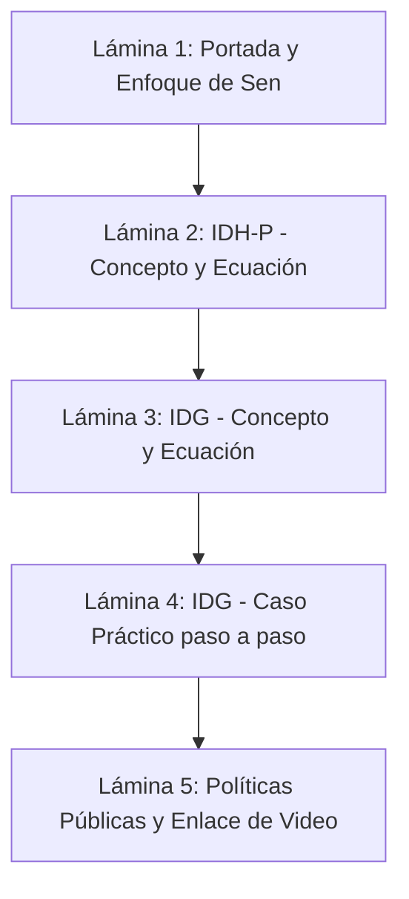

# Guía para la Presentación en Canva / PowerPoint

La sustentación académica de los resultados requiere estructurar una presentación visual de **cinco láminas** orientadas a la síntesis y al rigor analítico:

### Estrategia de exposición en video (Límite: 5 minutos):
* **Dosificación del tiempo:** Asignar 1 minuto por lámina para garantizar un ritmo ágil y evitar redundancias.
* **División equitativa:** En una exposición en parejas, el estudiante A sustenta la dimensión planetaria y ambiental (IDH-P) y el estudiante B aborda las brechas y equidad de género (IDG). Ambos ponentes deben proyectar su rostro y modular sus intervenciones para denotar una co-creación del informe.
* **Evidencia cuantitativa:** Respaldar cada afirmación empírica con los valores y pasos calculados para el "Ecuador Simulado", transformando la teoría en evidencia aplicable.
