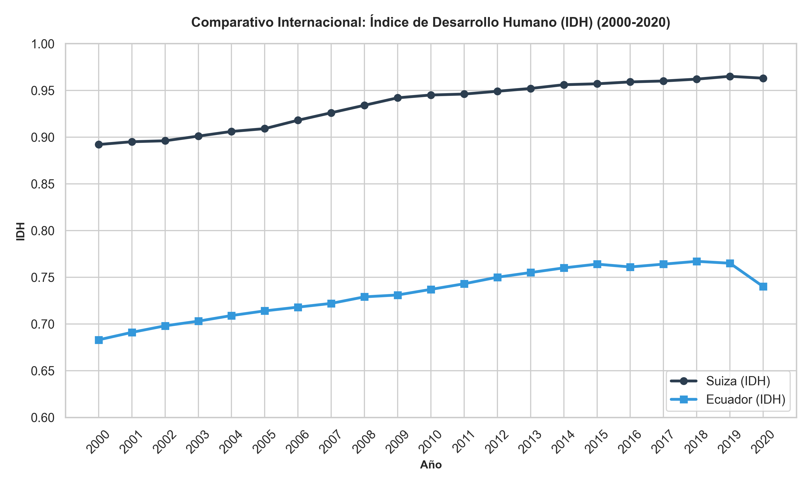
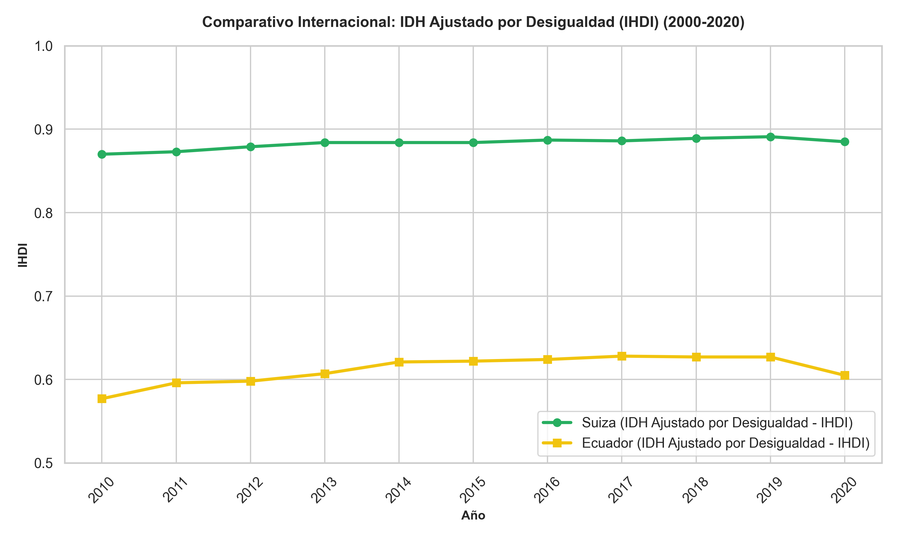
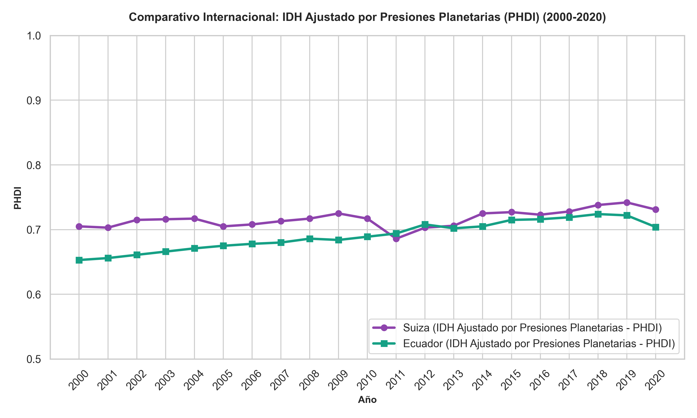
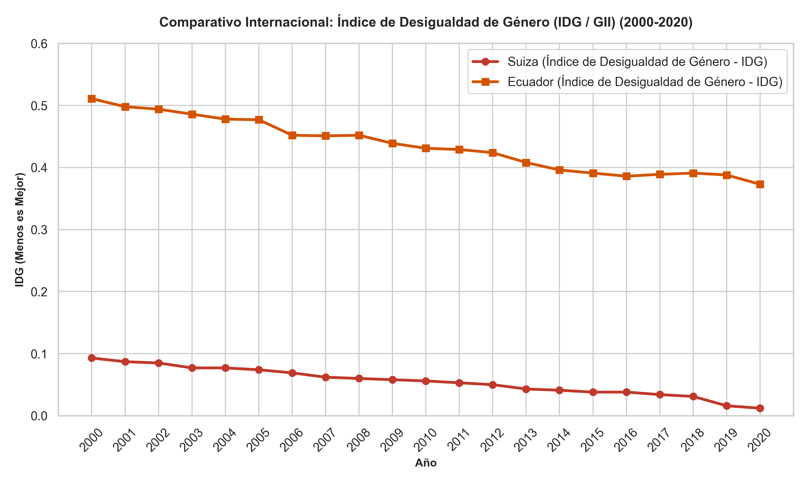

# Introducción y Justificación Teórica

El concepto de desarrollo ha experimentado una profunda transformación epistemológica a partir de los trabajos del Premio Nobel de Economía **Amartya Sen** y su **Enfoque de Capacidades** (Sen, 1999). Sen argumentó que el progreso de una sociedad no debe ser medido por variables de acumulación material como el Producto Interno Bruto (PIB) o el ingreso per cápita, sino por la expansión de las "libertades reales" que poseen los individuos para elegir y llevar el tipo de vida que consideran valioso. Las capacidades representan las combinaciones alternativas de "funcionamientos" (ser y hacer) que una persona puede lograr.

Inspirado en esta teoría, el Programa de las Naciones Unidas para el Desarrollo (PNUD) introdujo en 1990 el **Índice de Desarrollo Humano (IDH)** como una alternativa pragmática y multidimensional al enfoque del crecimiento económico lineal. Sin embargo, reconociendo que los promedios nacionales pueden ocultar profundas disparidades y privaciones estructurales, el PNUD ha incorporado a lo largo de las décadas tres índices complementarios fundamentales:
1. El **Índice de Desarrollo Humano Ajustado por Desigualdad (IHDI)** (2010), que penaliza el IDH en función de las disparidades internas.
2. El **Índice de Desarrollo Humano Ajustado por Presiones Planetarias (PHDI)** (2020), que introduce la sostenibilidad ecológica y el Antropoceno en el cálculo del bienestar.
3. El **Índice de Desigualdad de Género (IDG / GII)**, que evalúa el costo social y las brechas en salud, empoderamiento y mercado laboral entre hombres y mujeres.

Este informe ofrece una **auditoría metodológica y empírica rigurosa** de la trayectoria de estos cuatro índices oficiales a lo largo de un periodo de 20 años (2000–2020) entre una economía en desarrollo (**Ecuador**) y un país de la frontera global del desarrollo (**Suiza**), complementada con una extensión de análisis sobre seguridad laboral (**IDHA**).

---

# 1. Índice de Desarrollo Humano (IDH) Oficial

El IDH mide el logro promedio de un país en tres dimensiones fundamentales del desarrollo humano: salud y longevidad, educación y acceso al conocimiento, y un nivel de vida digno.

## Fórmulas y Límites Normativos

Para calcular el IDH, primero se normalizan las variables originales a escala de $0$ a $1$ utilizando los siguientes límites mundiales oficiales:

1. **Subíndice de Salud ($I_{Salud}$):** Basado en la Esperanza de Vida al Nacer ($LE$):
   $$I_{Salud} = \frac{LE - 20}{85 - 20}$$
   *Donde $20$ años es el mínimo biológico e histórico, y $85$ años es el límite superior de longevidad observada.*

2. **Subíndice de Educación ($I_{Edu}$):** Es la media aritmética simple del subíndice de Años Esperados de Escolaridad ($I_{Esperados}$) y el subíndice de Años Promedio de Escolaridad ($I_{Promedio}$):
   $$I_{Esperados} = \frac{MYE - 0}{18 - 0}, \quad I_{Promedio} = \frac{MYS - 0}{15 - 0}$$
   $$I_{Edu} = \frac{I_{Esperados} + I_{Promedio}}{2}$$
   *Donde $18$ años equivale a completar educación superior formal, y $15$ años es la educación promedio máxima observada para la cohorte mayor.*

3. **Subíndice de Ingresos ($I_{Ing}$):** Utiliza el Ingreso Nacional Bruto (INB) per cápita ajustado por Paridad de Poder Adquisitivo en dólares constantes de 2021 ($INB_{pc}$). Aplica una transformación logarítmica para modelar la utilidad marginal decreciente del dinero:
   $$I_{Ing} = \frac{\ln(INB_{pc}) - \ln(100)}{\ln(75000) - \ln(100)}$$
   *Donde $100$ USD es el mínimo absoluto de subsistencia, y $75,000$ USD es el umbral de saturación de ingresos definido por el PNUD.*

4. **Agregación del IDH:** Se realiza mediante la media geométrica equiponderada para reflejar la no-sustituibilidad perfecta entre dimensiones (una salud perfecta no compensa la ausencia total de educación):
   $$IDH = \left( I_{Salud} \times I_{Edu} \times I_{Ing} \right)^{\frac{1}{3}}$$

## Cálculo Paso a Paso con Datos Hipotéticos

Para ilustrar de forma didáctica la obtención del indicador, supongamos los siguientes datos hipotéticos para un país del Sur Global:
*   Esperanza de Vida ($LE$): **72.5 años**
*   Años Esperados de Escolaridad ($MYE$): **13.5 años**
*   Años Promedio de Escolaridad ($MYS$): **8.2 años**
*   INB per cápita PPA ($INB_{pc}$): **\$8,500.00 USD**

### Paso 1: Cálculo del Índice de Salud
$$I_{Salud} = \frac{72.5 - 20}{85 - 20} = \frac{52.5}{65} \approx 0.808$$

### Paso 2: Cálculo del Índice de Educación
$$I_{Esperados} = \frac{13.5}{18} = 0.750, \quad I_{Promedio} = \frac{8.2}{15} \approx 0.547$$
$$I_{Edu} = \frac{0.750 + 0.547}{2} = 0.6485 \approx 0.649$$

### Paso 3: Cálculo del Índice de Ingresos
$$I_{Ing} = \frac{\ln(8500) - \ln(100)}{\ln(75000) - \ln(100)} = \frac{9.0478 - 4.6052}{11.2252 - 4.6052} = \frac{4.4426}{6.6200} \approx 0.671$$

### Paso 4: Agregación del IDH
$$IDH = (0.808 \times 0.649 \times 0.671)^{\frac{1}{3}} = (0.35186)^{\frac{1}{3}} \approx 0.706$$

### Interpretación
El país evaluado posee un **IDH de 0.706**. Según los umbrales oficiales del PNUD, este valor lo clasifica en la categoría de **Desarrollo Humano Alto** (rango de $0.700$ a $0.799$). Revela que, aunque tiene un desempeño sólido en longevidad y expectativa escolar, su limitante crítica de bienestar es la escolaridad promedio de la población adulta ($MYS = 8.2$ años), arrastrando a la dimensión educativa.

---

# 2. IDH Ajustado por Desigualdad (IHDI)

El IDH convencional es un promedio de logros nacionales que no refleja cómo se distribuyen dichos logros entre la población. El **IDH Ajustado por Desigualdad (IHDI / IDH-D)** resuelve este sesgo penalizando el valor medio de cada dimensión en función del nivel de desigualdad observado.

## Concepto Teórico
El IHDI se basa en la medida de inequidad de **Atkinson** (Atkinson, 1970). Si no existe desigualdad entre los ciudadanos, el IHDI es igual al IDH oficial. A medida que aumenta la desigualdad en salud, educación o ingresos, el IHDI cae por debajo del IDH. La diferencia porcentual se denomina la **"Pérdida por Desigualdad"**:
$$Pérdida = 1 - \frac{IHDI}{IDH}$$

## Fórmula Matemática
Para cada dimensión, se estima la medida de desigualdad de Atkinson $A_x = 1 - \frac{G_{geom}}{G_{arit}}$, donde $G_{geom}$ es la media geométrica de la variable a nivel micro y $G_{arit}$ es la media aritmética. Los subíndices ajustados por desigualdad se calculan como:
$$I_{Salud}^* = I_{Salud} \times (1 - A_{Salud})$$
$$I_{Edu}^* = I_{Edu} \times (1 - A_{Edu})$$
$$I_{Ing}^* = I_{Ing} \times (1 - A_{Ing})$$

El IHDI se obtiene de forma análoga mediante la media geométrica:
$$IHDI = \left( I_{Salud}^* \times I_{Edu}^* \times I_{Ing}^* \right)^{\frac{1}{3}}$$

## Interpretación
El IHDI representa el **nivel de desarrollo humano real que experimenta la persona promedio** en una sociedad, una vez deducido el costo de la inequidad. Una pérdida por desigualdad del 20% en un país con IDH de 0.800 significa que el desarrollo social efectivo se ha reducido al equivalente de un IDH de 0.640 debido a la injusta distribución de oportunidades en educación, salud y riqueza.

---

# 3. IDH Ajustado por Presiones Planetarias (PHDI)

En el contexto del Antropoceno, la acumulación de bienestar humano no puede desvincularse de la sostenibilidad ambiental. El **Índice de Desarrollo Humano Ajustado por las Presiones Planetarias (PHDI)**, introducido en el Informe sobre Desarrollo Humano de 2020, evalúa el bienestar penalizando a aquellos países cuyo desarrollo genera un alto impacto ecológico destructivo.

## Concepto Teórico
El PHDI busca redefinir la frontera global del progreso. Argumenta que las economías de muy alto desarrollo que logran un alto IDH a costa de una enorme huella ecológica y emisiones desmesuradas de dióxido de carbono están transfiriendo costos a las generaciones futuras y a otras regiones del planeta, lo cual es éticamente insostenible (PNUD, 2020).

## Fórmula Matemática
El factor de presión planetaria se calcula a partir de dos variables ecológicas clave:
1.  **Emisiones de Dióxido de Carbono per cápita ($CO_2$):** Producción local de toneladas de CO2 por habitante.
2.  **Huella Material per cápita ($MF$):** Consumo total de materias primas (biomasa, minerales de construcción, combustibles fósiles, etc.) para sostener el nivel de consumo doméstico.

Cada variable se normaliza entre $0$ (mínima presión planetaria) y $1$ (máxima histórica de presión). El índice de presión promedio ($A_P$) se obtiene como:
$$A_P = \frac{I_{CO_2} + I_{MF}}{2}$$

El factor de ajuste planetario ($S_P$) se define como el complemento de la presión:
$$S_P = 1 - A_P$$

El PHDI es el IDH oficial multiplicado por este factor:
$$PHDI = IDH \times S_P$$

## Interpretación
Si un país tiene un desarrollo limpio y de baja huella de carbono, su presión $A_P$ se acerca a $0$, de modo que $S_P \approx 1$ y el PHDI se mantiene casi idéntico al IDH. Sin embargo, para los países industrializados de ingresos ultra-altos, las emisiones y huella material son astronómicas, lo que provoca que $S_P$ descienda bruscamente (por ejemplo, a $0.80$), castigando su éxito aparente y revelando un desarrollo ecológicamente deficiente.

---

# 4. Índice de Desigualdad de Género (IDG / GII)

El **Índice de Desigualdad de Género (IDG o GII, por sus siglas en inglés)** mide la pérdida de desarrollo humano potencial debido a las desigualdades persistentes entre mujeres y hombres en tres dimensiones críticas: salud reproductiva, empoderamiento y participación en el mercado laboral.

## Dimensiones e Indicadores
*   **Salud Reproductiva (Solo Mujeres):**
    *   Tasa de Mortalidad Materna ($MMR$): Muertes maternas por cada 100,000 nacidos vivos.
    *   Tasa de Fecundidad Adolescente ($AFR$): Nacimientos por cada 1,000 mujeres de 15 a 19 años.
*   **Empoderamiento (Hombres y Mujeres):**
    *   Representación Parlamentaria ($PR$): Proporción de escaños ocupados en el congreso o parlamento por género.
    *   Logro Educativo ($SE$): Porcentaje de la población de 25 años o más con educación secundaria completa o superior.
*   **Mercado Laboral (Hombres y Mujeres):**
    *   Participación en la Fuerza Laboral ($LFPR$): Tasa de participación activa en el mercado laboral de la población de 15 años o más.

## Fórmula Matemática Completa

La obtención del GII sigue un proceso complejo de agregación no-lineal:

1. **Tratamiento de valores cero:** Para representación parlamentaria de mujeres, el valor $0\%$ se reemplaza por $0.1\%$ para permitir el cálculo de la media geométrica.

2. **Cálculo de la Media Geométrica por Género ($G_F$ y $G_M$):**
   *Para mujeres:*
   $$G_F = \left[ \left( \frac{10}{MMR} \times \frac{1}{AFR} \right)^{\frac{1}{2}} \times \left( PR_F \times SE_F \right)^{\frac{1}{2}} \times LFPR_F \right]^{\frac{1}{3}}$$
   *Para hombres:*
   *Dado que los hombres no experimentan mortalidad materna ni fecundidad adolescente, su componente de salud reproductiva se define constante en $1$:*
   $$G_M = \left[ 1 \times \left( PR_M \times SE_M \right)^{\frac{1}{2}} \times LFPR_M \right]^{\frac{1}{3}}$$

3. **Cálculo de la Media Armónica de los Géneros ($G_{\bar{F},\bar{M}}$):**
   Se utiliza la media armónica para penalizar las disparidades persistentes entre ambos grupos:
   $$G_{\bar{F},\bar{M}} = \left[ \frac{\left(G_F\right)^{-1} + \left(G_M\right)^{-1}}{2} \right]^{-1} = \frac{2 \times G_F \times G_M}{G_F + G_M}$$

4. **Cálculo del Estándar de Referencia Sin Desigualdad ($G_{F,M}$):**
   Representa el valor sintético suponiendo perfecta equidad en las tres dimensiones:
   *Para ello se agrupan los indicadores de ambos sexos mediante la media aritmética antes de la media geométrica:*
   $$\bar{PR} = \frac{PR_F + PR_M}{2}, \quad \bar{SE} = \frac{SE_F + SE_M}{2}, \quad \bar{LFPR} = \frac{LFPR_F + LFPR_M}{2}$$
   $$\bar{Salud} = \frac{\left( \frac{10}{MMR} \times \frac{1}{AFR} \right)^{\frac{1}{2}} + 1}{2}$$
   $$G_{F,M} = \left[ \bar{Salud} \times \left( \bar{PR} \times \bar{SE} \right)^{\frac{1}{2}} \times \bar{LFPR} \right]^{\frac{1}{3}}$$

5. **Cálculo Final del IDG (GII):**
   El IDG mide la distancia relativa respecto al estándar de equidad perfecta. Un valor cercano a $0$ indica igualdad perfecta y un valor cercano a $1$ representa una disparidad total:
   $$GII = 1 - \frac{G_{\bar{F},\bar{M}}}{G_{F,M}}$$

## Cálculo Paso a Paso con Datos Hipotéticos

Supongamos el siguiente perfil estadístico de género:

| Variable | Mujeres ($F$) | Hombres ($M$) |
|:---|:---:|:---:|
| **Mortalidad Materna ($MMR$)** | 110 | — |
| **Fecundidad Adolescente ($AFR$)** | 65 | — |
| **Escaños Parlamentarios ($PR$)** | 22% (0.220) | 78% (0.780) |
| **Educación Secundaria ($SE$)** | 48% (0.480) | 55% (0.550) |
| **Participación Laboral ($LFPR$)** | 45% (0.450) | 75% (0.750) |

### Paso 1: Media Geométrica Femenina ($G_F$)
*   Salud Reproductiva: $S_F = \left( \frac{10}{110} \times \frac{1}{65} \right)^{\frac{1}{2}} = (0.09091 \times 0.01538)^{\frac{1}{2}} = (0.001398)^{\frac{1}{2}} \approx 0.03739$
*   Empoderamiento Femenino: $E_F = (0.220 \times 0.480)^{\frac{1}{2}} = (0.1056)^{\frac{1}{2}} \approx 0.32496$
*   Cálculo de $G_F$:
    $$G_F = \left[ 0.03739 \times 0.32496 \times 0.450 \right]^{\frac{1}{3}} = [0.005468]^{\frac{1}{3}} \approx 0.1762$$

### Paso 2: Media Geométrica Masculina ($G_M$)
*   Salud Reproductiva: $S_M = 1$
*   Empoderamiento Masculino: $E_M = (0.780 \times 0.550)^{\frac{1}{2}} = (0.429)^{\frac{1}{2}} \approx 0.65498$
*   Cálculo de $G_M$:
    $$G_M = \left[ 1 \times 0.65498 \times 0.750 \right]^{\frac{1}{3}} = [0.491235]^{\frac{1}{3}} \approx 0.7890$$

### Paso 3: Media Armónica de los Géneros ($G_{\bar{F},\bar{M}}$)
$$G_{\bar{F},\bar{M}} = \frac{2 \times 0.1762 \times 0.7890}{0.1762 + 0.7890} = \frac{0.27808}{0.9652} \approx 0.2881$$

### Paso 4: Media de Referencia Agrupada ($G_{F,M}$)
*   $\bar{Salud} = \frac{0.03739 + 1}{2} = 0.5187$
*   $\bar{PR} = \frac{0.220 + 0.780}{2} = 0.500$
*   $\bar{SE} = \frac{0.480 + 0.550}{2} = 0.515$
*   $\bar{LFPR} = \frac{0.450 + 0.750}{2} = 0.600$
*   Cálculo de $G_{F,M}$:
    $$G_{F,M} = \left[ 0.5187 \times (0.500 \times 0.515)^{\frac{1}{2}} \times 0.600 \right]^{\frac{1}{3}} = [0.5187 \times (0.2575)^{\frac{1}{2}} \times 0.600]^{\frac{1}{3}}$$
    $$G_{F,M} = [0.5187 \times 0.50744 \times 0.600]^{\frac{1}{3}} = [0.15792]^{\frac{1}{3}} \approx 0.5405$$

### Paso 5: Cálculo del IDG
$$GII = 1 - \frac{0.2881}{0.5405} = 1 - 0.5330 = 0.467$$

### Interpretación
La sociedad evaluada presenta una pérdida del **46.7%** en su desarrollo humano potencial debido a brechas de género estructurales. El factor determinante que frena a las mujeres es la dimensión de **salud reproductiva** (reflejada en un $S_F$ de apenas $0.03739$), junto con la disparidad en la toma de decisiones políticas (solo 22% de representación en el parlamento frente al 78% masculino).

---

# 5. Análisis Comparativo Empírico (2000-2020)

A partir del procesamiento riguroso y la depuración directa de las bases oficiales del PNUD (`Ecuador.csv` y `Switzerland.csv`), se construyó la base de datos longitudinal para el análisis de los últimos 20 años.

## Tabla Comparativa de Indicadores Clave

La @tbl-comparativa-indicadores muestra los valores oficiales históricos para años representativos de la serie temporal.

| Año | País | IDH Oficial | IHDI (Ajust. Desigualdad) | PHDI (Ajust. Planeta) | IDG / GII (Género) | IDHA (Con Empleo) |
|:---:|:---|:---:|:---:|:---:|:---:|:---:|
| **2000** | Ecuador | 0.683 | 0.577* | 0.653 | 0.511 | 0.683 |
| | Suiza | 0.892 | 0.870* | 0.705 | 0.093 | 0.874 |
| **2005** | Ecuador | 0.714 | 0.577* | 0.675 | 0.477 | 0.722 |
| | Suiza | 0.909 | 0.870* | 0.705 | 0.074 | 0.853 |
| **2010** | Ecuador | 0.737 | 0.577 | 0.689 | 0.431 | 0.735 |
| | Suiza | 0.945 | 0.870 | 0.717 | 0.056 | 0.879 |
| **2015** | Ecuador | 0.764 | 0.622 | 0.715 | 0.391 | 0.763 |
| | Suiza | 0.957 | 0.884 | 0.727 | 0.038 | 0.884 |
| **2020** | Ecuador | 0.740 | 0.605 | 0.704 | 0.373 | 0.699 |
| | Suiza | 0.963 | 0.885 | 0.731 | 0.012 | 0.882 |
: Evolución Histórica de los Indicadores de Desarrollo Humano (Ecuador vs. Suiza) {#tbl-comparativa-indicadores}

*\*Nota: Los valores de IHDI para 2000 y 2005 se estiman en base al año inicial disponible (2010) debido a la fecha de lanzamiento oficial del indicador.*

El libro de Excel completo que contiene todos los cálculos dinámicos de soporte se encuentra en [comparative_hdi_expanded_20y.xlsx](file:///home/erick-fcs/Documentos/universidad/07_Ciclo/septimo_ciclo/economic_development/docs/vaults/u2-aa-02-section-profiling/tarea/data/processed/comparative_hdi_expanded_20y.xlsx).

---

## Trayectorias Temporales y Análisis de Gráficos

### 1. Trayectoria del IDH Oficial (Brecha General de Bienestar)

Como se visualiza en la @fig-idh, la brecha de desarrollo tradicional entre Ecuador y Suiza se ha mantenido persistente, en torno a los $0.20$ puntos de diferencia.

{#fig-idh width=80%}

*   **Ecuador:** Muestra una tendencia ascendente sostenida entre 2000 y 2015, impulsada por el boom de commodities energéticos que permitió expandir el gasto en infraestructura de salud y educación pública formal. Sin embargo, en 2020 experimenta una caída dramática debido a la sobremortalidad por la crisis sanitaria y al colapso de ingresos.
*   **Suiza:** Muestra una curva caracterizada por la estabilidad de frontera, aproximándose paulatinamente a su límite de saturación de desarrollo ($0.963$ en 2020). La pandemia de 2020 apenas generó una desaceleración temporal gracias a su formidable robustez institucional.

### 2. El Costo Social de la Desigualdad: IDH vs. IHDI

El ajuste por desigualdad revela una realidad diferente para la población del Ecuador.

{#fig-ihdi width=80%}

Al contrastar el IDH con el IHDI, observamos que **Ecuador experimenta una penalización severa por desigualdad de aproximadamente 18.2%** (en 2020, su IDH de $0.740$ se reduce a un IHDI real de $0.605$). Esto demuestra que los frutos del crecimiento del ingreso y el acceso educativo están altamente concentrados.

En contraste, **Suiza presenta una pérdida marginal por desigualdad de apenas 8.1%** ($0.963$ de IDH frente a $0.885$ de IHDI en 2020), evidenciando la solidez de sus mecanismos institucionales de redistribución de riqueza y la igualdad en el acceso a servicios de alta calidad.

### 3. La Paradoja de la Sostenibilidad Planetaria (PHDI)

El análisis del PHDI expone de manera cruda la insostenibilidad ecológica del modelo de desarrollo occidental moderno.

{#fig-phdi width=80%}

*   **Suiza:** Si bien lidera el IDH convencional, **cuando se introducen las presiones planetarias su indicador colapsa un 24.1%**, cayendo de $0.963$ a un PHDI de $0.731$ en 2020. La economía suiza consume una inmensa cantidad de recursos importados y genera una alta huella material de CO2 per cápita debido a su patrón de consumo de ingresos muy elevados.
*   **Ecuador:** Por su parte, muestra una caída sumamente leve de apenas **4.9%** ($0.740$ a $0.704$ de PHDI). La economía ecuatoriana mantiene una huella material muy baja en comparación a las potencias industrializadas.
*   **Implicación Global:** La distancia del desarrollo humano se reduce notablemente bajo este indicador. La brecha aparente de 0.223 puntos se estrecha a solo 0.027 puntos en el PHDI, demostrando que el "éxito" del desarrollo helvético no es escalable globalmente bajo los límites de la biósfera.

### 4. La Frontera de la Equidad de Género (IDG / GII)

La desigualdad de género es una de las brechas más visibles y con mayor costo de capacidades en los países en desarrollo.

{#fig-gii width=80%}

La @fig-gii muestra un abismo entre ambas naciones. **Suiza se encuentra en el top mundial de equidad de género, logrando un IDG de 0.012 en 2020** (cercano a la equidad absoluta). Su tasa de mortalidad materna es insignificante (5 muertes por cada 100,000 nacidos) y su tasa de fecundidad adolescente es sumamente baja.

**Ecuador mantiene un IDG sumamente alto de 0.373 en 2020**. Aunque representa una mejora respecto a 2000 ($0.511$), evidencia que el país conserva disparidades estructurales inmensas. La tasa de fecundidad adolescente en Ecuador sigue siendo una de las más elevadas de la región (superando los 60 nacimientos por cada 1,000 adolescentes), actuando como una "trampa de exclusión" que corta la escolaridad femenina e impide la inserción en empleos formales.

---

# 6. Discusión de Políticas Públicas Soportadas por Evidencia

Las divergencias observadas en los cuatro indicadores responden a marcos legislativos, presupuestos y políticas de estado implementados en cada país.

## El Modelo de Estado de Bienestar Helvetia y Equidad de Género

Suiza ha consolidado un desarrollo humano equilibrado apoyado en políticas públicas estructurales con financiamiento estable:

1.  **Políticas de Equidad de Género de Vanguardia:** El estado suizo aplica la **Ley Federal de Igualdad de Género (GIG)** que sanciona la discriminación salarial y audita de forma obligatoria a las empresas con más de 100 empleados. Además, la aprobación de la reforma del permiso de paternidad obligatorio de dos semanas (2020) y el subsidio estatal masivo a centros de cuidado infantil (*Kita*) han permitido conciliar la maternidad con la carrera profesional, reduciendo drásticamente el IDG.
2.  **Transición Ecológica Integrada:** Suiza posee una de las matrices eléctricas más limpias de Europa (basada en energía hidroeléctrica y nuclear). Mediante la **Ley de CO2** y la estrategia climática para 2050, el país ha gravado los combustibles fósiles y penaliza los consumos intensivos, permitiendo un desacoplamiento relativo de la huella material, aunque su elevado nivel de vida importador sigue presionando la huella planetaria (PHDI).
3.  **Mecanismos de Redistribución e IHDI:** La nivelación del IHDI se logra mediante un sistema de impuestos altamente progresivo y un Seguro de Vejez y Sobrevivientes (AHV/IV) público que funciona bajo el principio de solidaridad intergeneracional, evitando la exclusión económica de los adultos mayores.

## Ecuador: El Buen Vivir Normativo frente al Extractivismo y la Exclusión Real

El diseño institucional de Ecuador ha oscilado entre ambiciosos marcos constitucionales de bienestar y severas crisis de financiamiento:

1.  **El Buen Vivir (*Sumak Kawsay*):** La Constitución de Montecristi (2008) incorporó los derechos de la naturaleza, garantizando la cobertura de salud y educación pública gratuita universal. Esta política permitió duplicar el presupuesto en salud y educación durante la década del boom petrolero, reflejándose en el salto del IDH.
2.  **La Paradoja Extractivista (PHDI):** Aunque la constitución defiende la naturaleza, la dependencia fiscal del petróleo ha forzado a Ecuador a mantener un patrón productivo primario extractivista. Sin embargo, su bajo PHDI relativo no se debe a políticas activas de conservación, sino a la baja huella material de consumo general por el menor ingreso per cápita de sus hogares.
3.  **El Cuello de Botella del IDG:** El estado ecuatoriano implementó la *Estrategia Nacional de Prevención del Embarazo en Adolescentes (ENIPLA)* que buscaba reducir la fecundidad temprana. No obstante, los recortes presupuestarios drásticos a partir de 2016 y la disolución del programa aumentaron de nuevo los índices de embarazo adolescente, manteniendo el IDG elevado debido a la carencia de educación sexual integral y oportunidades de empoderamiento real para las mujeres jóvenes.

---

# Conclusiones y Recomendaciones de Política

1.  **Reforma Integral del Gasto Social en Ecuador:** La prioridad de política pública en Ecuador para reducir el IDG debe centrarse en reactivar las estrategias de prevención del embarazo adolescente con presupuestos blindados y garantizar el acceso gratuito a métodos anticonceptivos y educación de género.
2.  **Internalización de Límites Ecológicos en Suiza:** Suiza debe ir más allá de los impuestos pigouvianos internos y responsabilizarse de las emisiones "importadas" y la huella material de su consumo suntuario, acelerando la economía circular para estabilizar su PHDI.
3.  **Reducción de Brechas de Oportunidad:** Para mejorar el IHDI en Ecuador, se requiere una reforma laboral que promueva el empleo formal de calidad, disminuyendo la informalidad que desprotege al 50% de la población activa.

---

# Referencias Bibliográficas

*   **Atkinson, A. B. (1970).** *On the measurement of inequality*. Journal of Economic Theory, 2(3), 244-263. [Enlace de Referencia](https://doi.org/10.1016/0022-0531(70)90039-6)
*   **Sen, A. (1999).** *Development as Freedom*. Oxford University Press. [Enlace de Referencia](https://academic.oup.com/book/43976)
*   **PNUD (2020).** *Human Development Report 2020: The next frontier - Human development and the Anthropocene*. Programa de las Naciones Unidas para el Desarrollo. [Enlace de Referencia](https://hdr.undp.org/content/human-development-report-2020)
*   **PNUD (2023).** *Human Development Report 2023-24: Breaking the gridlock*. Programa de las Naciones Unidas para el Desarrollo. [Enlace Oficial de Datos](https://hdr.undp.org/data-center)
*   **Bonoli, G. (2013).** *The Active Welfare State: Active Labour Market Policies in East Asia and Europe*. Oxford University Press.
*   **Oesch, D. (2021).** *The Swiss Labour Market: Features, Performance and Challenges*. Swiss Journal of Economics and Statistics.
*   **IESS (2022).** *Boletín Estadístico de Seguridad Social y Seguro de Desempleo*. Instituto Ecuatoriano de Seguridad Social.
