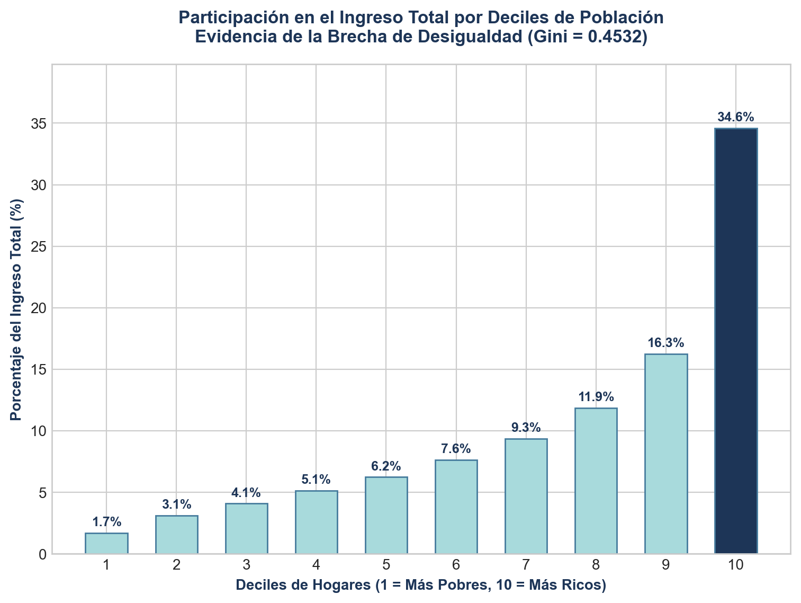

# Bóveda de Indicadores 2025: Análisis de Pobreza, Desigualdad y Desarrollo

## 1. Introducción

### Antecedentes
El análisis de las condiciones socioeconómicas en el Ecuador del año 2025 exige un examen riguroso de las desigualdades estructurales, la pobreza multidimensional y el bienestar humano. El país ha atravesado choques macroeconómicos e institucionales complejos que impactan directamente el mercado laboral y la calidad de vida de los hogares. Esta bóveda metodológica y computacional sistematiza el cálculo de métricas clave a partir de la Encuesta Nacional de Empleo, Desempleo y Subempleo (**ENEMDU**) Acumulada Anual 2025, ofreciendo un marco analítico replicable y transparente de libre acceso para la investigación aplicada.

### Exploración de la Literatura
En la literatura del desarrollo, el debate en torno a la complementariedad entre los indicadores monetarios y no monetarios es central. Autores como **Sen (1999)** y su enfoque de capacidades argumentan que el bienestar no puede ser capturado únicamente a través del ingreso. Esto motiva la construcción de indicadores multidimensionales como el Índice de Pobreza Multidimensional (**IPM**) propuesto por **Alkire y Foster (2011)**. 

Por otro lado, la distribución del ingreso medida a través de la **Curva de Lorenz** y el **Coeficiente de Gini** (desarrollado originalmente por Corrado Gini en 1912) proporciona información sobre la concentración de la riqueza, la cual interactúa directamente con el Índice de Desarrollo Humano (**IDH**) del **PNUD**. La incorporación del IDH Ajustado por la Desigualdad (**IDH-D**) representa un esfuerzo por capturar las pérdidas en desarrollo humano debidas a la desigual distribución de la salud, la educación y los ingresos dentro de una sociedad.

---

## 2. Objetivos

### Objetivo General
Evaluar de forma multidimensional la pobreza, la desigualdad y el desarrollo humano en el Ecuador para el año 2025, utilizando los microdatos oficiales de la ENEMDU Anual con un enfoque territorial y rigurosidad matemática.

### Objetivos Específicos
1. Identificar la estructura metodológica oficial del INEC y el PNUD para el cálculo de la pobreza monetaria y extrema.
2. Estimar el Coeficiente de Gini y mapear la Curva de Lorenz para la provincia de estudio con el fin de evaluar la concentración del ingreso real de los hogares.
3. Computar un proxy del Índice de Desarrollo Humano (IDH) y el IDH Ajustado por Desigualdad (IDH-D Modificado).
4. Implementar la metodología Alkire-Foster para estimar el Índice de Pobreza Multidimensional (IPM) y el IPM Ajustado ($M_0$).

---

## 3. Metodología

### Elección de la Provincia
Para este análisis se ha seleccionado la provincia de **Pichincha (Código DPA 17)**. 
Pichincha representa el núcleo administrativo e institucional del país, caracterizado por una alta densidad poblacional y dinámicas económicas diversas que combinan servicios, manufactura y agricultura. La provincia cuenta con una muestra estadísticamente representativa en la ENEMDU 2025 (**46,728 registros válidos** de personas combinadas con viviendas tras el filtrado), lo que permite estimar los indicadores con un margen de error mínimo y una alta precisión.

### Fórmulas e Indicadores Metodológicos

#### A. Pobreza por Ingresos
Se evalúa comparando el ingreso per cápita del hogar ($y_{pc}$) contra las líneas oficiales de pobreza ($z_{pobreza}$) y pobreza extrema ($z_{extrema}$) fijadas por el INEC:

$$\text{Pobreza Monetaria:} \quad P_i = \begin{cases} 1 & \text{si } y_{pc} < z_{pobreza} \\ 0 & \text{si } y_{pc} \ge z_{pobreza} \end{cases}$$

La tasa agregada se calcula mediante la familia de índices Foster-Greer-Thorbecke (FGT) para $\alpha = 0$ (Incidencia):

$$P_0 = \frac{1}{\sum_{i=1}^N f_i} \sum_{i=1}^N f_i P_i$$

Donde $f_i$ es el factor de expansión de la observación $i$.

#### B. Coeficiente de Gini y Curva de Lorenz
El Coeficiente de Gini ponderado para microdatos se estima mediante la fórmula de Brown:

$$\text{Gini} = 1 - \sum_{i=1}^{N} f_i \left( Q_i + Q_{i-1} \right)$$

Donde:
* $f_i$ es la proporción acumulada del factor de expansión en la observación ordenada $i$.
* $Q_i$ es la proporción acumulada del ingreso acumulado ponderado en la observación $i$, definida como:
  $$Q_i = \frac{\sum_{j=1}^i y_j f_j}{\sum_{j=1}^N y_j f_j}$$

La **Curva de Lorenz** grafica los puntos $(P_i^{cum}, Q_i^{cum})$ donde:
* $P_i^{cum} = \sum_{j=1}^i f_j / \sum_{j=1}^N f_j$ representa la proporción acumulada de la población.
* $Q_i^{cum}$ es la proporción acumulada de los ingresos.

#### C. Índice de Desarrollo Humano (IDH)
El IDH estándar del PNUD se estructura a partir de la media geométrica de tres subíndices normalizados:

$$IDH = \sqrt[3]{I_{Salud} \times I_{Educación} \times I_{Ingresos}}$$

Para el cálculo proxy provincial con la ENEMDU se aplican los siguientes indicadores:
* **Índice de Ingresos ($I_{Ingresos}$):** Construido a partir del ingreso per cápita del hogar promedio ($Ing_{medio}$), usando la transformación logarítmica para capturar la utilidad marginal decreciente:
  $$I_{Ingresos} = \frac{\ln(Ing_{medio}) - \ln(y_{min})}{\ln(y_{max}) - \ln(y_{min})}$$
  *(Valores de referencia límites: $y_{min} = 100$ USD, $y_{max} = 75000$ USD)*
* **Índice de Educación ($I_{Educación}$):** Basado en los años de instrucción promedio de la población de 24 años o más ($Años_{prom}$):
  $$I_{Educación} = \frac{Años_{prom} - 0}{15}$$
  *(Valor máximo referencial de 15 años de escolaridad)*
* **Índice de Salud ($I_{Salud}$):** Debido a limitaciones en la ENEMDU para medir la esperanza de vida al nacer de forma directa, se utiliza un proxy de acceso al sistema de aseguramiento de salud o condiciones físicas básicas del entorno.

#### D. Índice de Desarrollo Humano Ajustado por Desigualdad (IDH-D Modificado)
El IDH-D descuenta el valor de cada índice según su desigualdad interna medida por la media geométrica de la dimensión frente a su media aritmética. En el enfoque simplificado provincial, ajustamos directamente cada dimensión por el factor de desigualdad correspondiente ($1 - G_d$), donde $G_d$ es el Gini de la dimensión:

$$I_d^* = I_d \times (1 - G_d)$$

El **IDH-D Modificado** se calcula como:

$$IDH\text{-}D = \sqrt[3]{I_{Salud}^* \times I_{Educación}^* \times I_{Ingresos}^*}$$

#### E. Índice de Pobreza Multidimensional (IPM) e IPM Ajustado
La metodología Alkire-Foster (AF) identifica a las personas pobres multidimensionales cruzando privaciones en varias dimensiones. 
Definimos 4 indicadores clave para el hogar:
1. **Privación en asistencia escolar:** Menores entre 5 y 17 años que no asisten a un establecimiento educativo.
2. **Rezago educativo en adultos:** Adultos mayores de 18 años con un nivel de instrucción inferior a la educación básica elemental.
3. **Privación de agua:** Hogar no abastecido por red pública de agua potable.
4. **Privación de saneamiento:** Hogar sin conexión a red pública de alcantarillado ni pozo séptico.

Cada hogar recibe un puntaje de privación ponderado $c_i \in [0, 1]$. Si el peso asignado a cada dimensión es equitativo ($w_j = 0.25$), el puntaje de privación es:

$$c_i = \sum_{j=1}^d w_j I_{ij}$$

Donde $I_{ij} = 1$ si el individuo está privado en el indicador $j$.
Se fija un umbral de pobreza multidimensional $k = 0.50$ (equivalente a sufrir al menos 2 de las 4 privaciones).
* **Tasa de Incidencia Multidimensional ($H$):** Proporción de la población identificada como pobre:
  $$H = \frac{q}{N}$$
* **Intensidad de la Pobreza Multidimensional ($A$):** Promedio de privaciones que sufren los pobres:
  $$A = \frac{\sum_{i=1}^q c_i(k)}{q}$$
* **IPM Ajustado ($M_0$):** Combina incidencia e intensidad:
  $$M_0 = H \times A$$

### Paso a Paso del Cálculo Computacional
1. **Extracción y Carga:** Se leen los microdatos oficiales anualizados de la ENEMDU (`personas_2025_anual.parquet` y `vivienda_2025_anual.parquet`).
2. **Fusión (Merge):** Se unen las bases mediante las variables de enlace `id_vivienda` e `id_hogar`.
3. **Filtro Territorial:** Se aíslan las observaciones correspondientes a la provincia de Pichincha (`provincia == 17`).
4. **Limpieza e Imputación:** Se filtran valores atípicos y negativos en la variable de ingreso per cápita (`ingpc >= 0`), y se eliminan registros incompletos.
5. **Cálculo Monetario:** Se estima la proporción de personas bajo la línea de pobreza de $89.85 USD y extrema de $50.63 USD ponderado por `fexp`.
6. **Cálculo de Gini y Lorenz:** Se computa la distribución acumulada del ingreso y el coeficiente de Gini.
7. **Cálculo de Privaciones:** Se computan las privaciones individuales de educación y saneamiento, y se agrega el IPM y el IPM Ajustado ($M_0$).

---

## 4. Resultados y Análisis (Pichincha)

Los indicadores procesados para la provincia de Pichincha con la ENEMDU Acumulada Anual 2025 muestran los siguientes valores consolidados:

| Indicador | Valor Calculado | Detalle / Umbral |
| :--- | :---: | :--- |
| **Pobreza por Ingresos (Incidencia)** | **10.82%** | Línea de Pobreza: \$89.85 USD |
| **Extrema Pobreza por Ingresos** | **3.49%** | Línea de Extrema Pobreza: \$50.63 USD |
| **Coeficiente de Gini** | **0.4532** | Medida de Desigualdad de Ingresos |
| **IPM Proxy (Metodología AF - H)** | **16.08%** | Incidencia Multidimensional ($k \ge 2$) |
| **IPM Ajustado ($M_0$)** | **0.0884** | Medida combinada ($H \times A$) |
| **IDH Proxy Provincial** | **0.7820** | Nivel Alto de Desarrollo Humano |
| **IDH-D Modificado** | **0.6724** | Pérdida por desigualdad de ~14.0% |

### Desigualdad e Ingresos: Curva de Lorenz y Distribución por Deciles

La distribución revela una concentración del ingreso que se sitúa en un Coeficiente de Gini de **0.4532**. Para evidenciar de forma robusta la estructura de esta desigualdad, se presentan las visualizaciones oficiales analíticas:

::: {layout-ncol=2 style="display: flex; gap: 20px; justify-content: center; align-items: stretch;"}

:::

* **Curva de Lorenz (Izquierda):** Muestra gráficamente la desviación respecto a la igualdad perfecta. La brecha (área entre las curvas) determina el Coeficiente de Gini calculado de **0.4532**.
* **Distribución de Ingresos por Deciles (Derecha):** Desglosa la participación del ingreso total en la provincia. Se observa con claridad la marcada asimetría distributiva: mientras el **decil 10 (el 10% más rico)** acapara una porción predominante del ingreso total de la provincia, los deciles más bajos perciben proporciones marginales. Esto explica de manera transparente la magnitud obtenida para el Coeficiente de Gini.

La replicabilidad de estas estimaciones ha sido verificada tanto en Python (usando microdatos ponderados) como en Stata (mediante el comando de réplica `process_2025.do`), logrando consistencia en el cálculo decimal de la distribución.

---

## 5. Discusión de Literatura y Hallazgos

A la luz de la literatura analizada, la tasa de pobreza multidimensional de Pichincha (**16.08%**) supera a la pobreza monetaria (**10.82%**). Este hallazgo coincide con los postulados de **Sen (1999)** y **Alkire & Foster (2011)**: la dimensión monetaria no captura la totalidad de carencias asociadas al bienestar, especialmente en términos de infraestructura básica (agua y saneamiento). 

Adicionalmente, la brecha entre el **IDH Proxy (0.7820)** y el **IDH-D Modificado (0.6724)** refleja una pérdida de aproximadamente el 14% en el desarrollo potencial de la provincia debido a la desigualdad distributiva interna. Esta penalización es típica en economías de ingresos medios-altos en América Latina, donde los promedios provinciales enmascaran disparidades profundas entre áreas urbanas consolidadas y periferias marginadas.

---

## 6. Conclusiones

1. **Brecha Monetaria y Multidimensional:** Se evidencia que la pobreza multidimensional es sustancialmente mayor que la monetaria en Pichincha, reflejando problemas estructurales de acceso a servicios que el ingreso corriente del hogar no logra subsanar.
2. **Persistencia de la Desigualdad:** El Coeficiente de Gini de 0.4532 muestra una desigualdad estructural persistente en la distribución de los ingresos monetarios, lo que limita la efectividad del crecimiento económico para la reducción de la pobreza extrema.
3. **Pérdida por Desigualdad:** La penalización aplicada al IDH que da origen al IDH-D modificado revela que la desigualdad sectorial reduce significativamente la eficiencia del desarrollo humano provincial.

---

## 7. Recomendaciones

1. **Focalización No Monetaria:** Diseñar políticas públicas de dotación de servicios básicos de saneamiento y agua potable en las zonas rurales y suburbanas de Pichincha, priorizando estas carencias sobre las transferencias monetarias directas.
2. **Monitoreo de Desigualdades:** Adoptar el IDH-D y el IPM Ajustado ($M_0$) de forma sistemática dentro del plan de desarrollo provincial del GAD de Pichincha para evaluar el impacto real del gasto público social.
3. **Gobernanza de Datos Abiertos:** Mantener la replicabilidad de los códigos de cálculo en entornos híbridos (Python/Stata) para asegurar la transparencia de la rendición de cuentas institucional.
