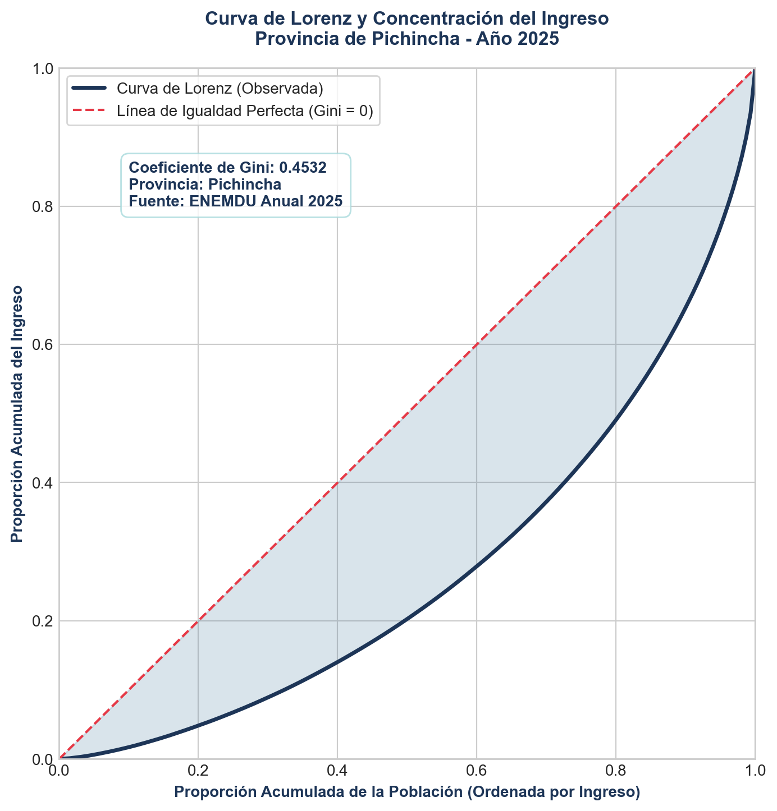
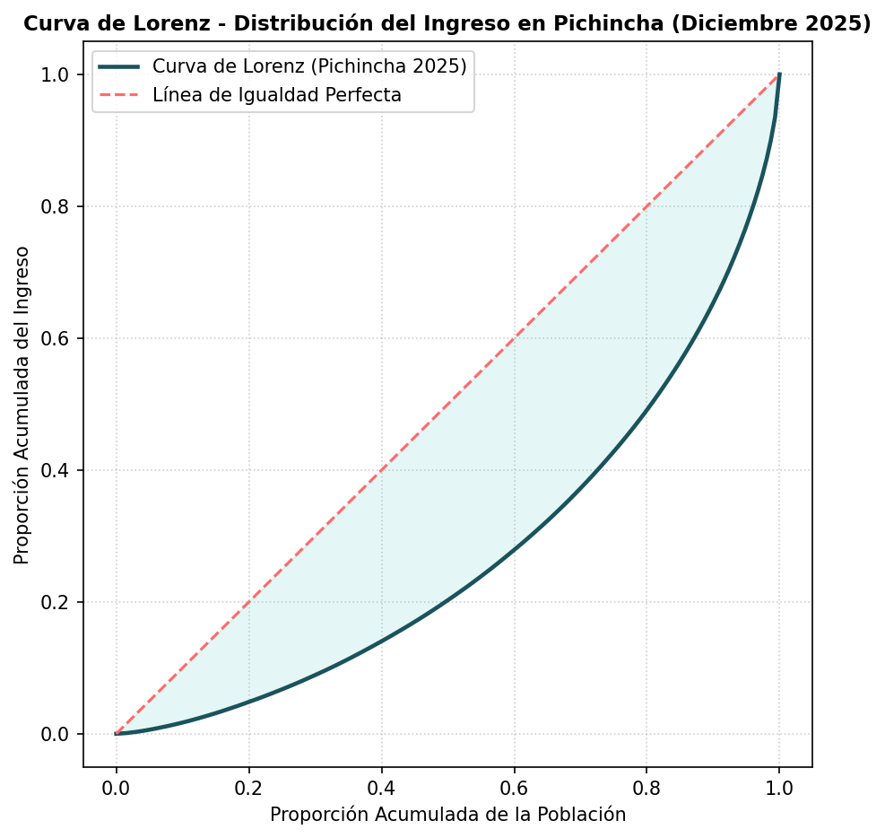

# Apartado 1: Medición de la Desigualdad mediante el Coeficiente de Gini

La medición de la desigualdad económica es un componente crítico para comprender los determinantes de la doble informalidad en el Ecuador. Para la provincia de **Pichincha**, utilizando la base anualizada y acumulada de la **ENEMDU 2025**, estimamos la concentración del ingreso per cápita del hogar.

## Metodología y Formulación Matemática

El Coeficiente de Gini se calcula a partir de los microdatos expandidos utilizando la formulación ponderada de Brown. Sea $Y = (y_1, y_2, \dots, y_n)$ el vector de ingresos ordenado de forma ascendente ($y_1 \le y_2 \le \dots \le y_n$) y $W = (w_1, w_2, \dots, w_n)$ el vector de factores de expansión asociados (ponderaciones poblacionales).

Definimos las proporciones acumuladas de población ($p_i$) e ingresos ($q_i$) para cada observación $i$ como:

$$p_i = \frac{\sum_{j=1}^{i} w_j}{\sum_{j=1}^{N} w_j}$$

$$q_i = \frac{\sum_{j=1}^{i} w_j y_j}{\sum_{j=1}^{N} w_j y_j}$$

El Coeficiente de Gini ponderado está dado por la relación:

$$\text{Gini} = 1 - \sum_{i=1}^{N} f_i \left( q_i + q_{i-1} \right)$$

Donde $f_i = p_i - p_{i-1} = \frac{w_i}{\sum_{j=1}^{N} w_j}$ representa la fracción de población que aporta la observación $i$, con $q_0 = 0$.

## Tratamiento y Sanitización de Microdatos

Para garantizar estimaciones insesgadas y consistentes con los estándares del Instituto Nacional de Estadística y Censos (INEC), aplicamos el siguiente protocolo en la base de datos:

1. **Filtro Geográfico:** Se seleccionó a la población residente en la provincia de Pichincha filtrando por la variable de localización `ciudad` (código de provincia `17`).
2. **Tratamiento de Valores Nulos:** Se eliminaron de forma estricta las observaciones con valores perdidos (`missing`) en la variable de ingreso per cápita del hogar (`ingpc`).
3. **Depuración de Ingresos Negativos:** Se removieron los valores menores a cero (`ingpc < 0`) para evitar distorsiones matemáticas en los denominadores acumulativos de la curva.
4. **Representatividad Muestral:** La muestra final sanitizada consta de **46,728 registros válidos**, con una población expandida total de **3'375,369.56 habitantes**.

## Resultados del Coeficiente de Gini

La estimación arrojó un **Coeficiente de Gini de 0.4532**. Este resultado refleja una moderada concentración del ingreso en la provincia de Pichincha y sirve como línea base para los modelos econométricos multivariantes.

---

# Apartado 2: Construcción y Visualización de la Curva de Lorenz

La Curva de Lorenz es la representación gráfica de la función de distribución acumulada de ingresos. Permite contrastar visualmente la distribución observada frente a una distribución hipotética de igualdad perfecta.

## Puntos de la Curva de Lorenz

Los puntos acumulados $(p_i, q_i)$ representan la proporción de ingresos acumulados obtenidos por el percentil de población correspondiente. La diagonal de $45^\circ$ que conecta los puntos $(0,0)$ y $(1,1)$ representa la **Línea de Igualdad Perfecta** (donde el $x\%$ de la población percibe exactamente el $x\%$ del ingreso total).

## Consistencia y Validación Interplataforma

Para asegurar la reproducibilidad y robustez de los cálculos en el pipeline institucional, se generaron las visualizaciones de la curva de Lorenz de manera independiente en **Python** (a través de `matplotlib` y cargando datos en formato `Parquet`) y en **Stata** (a través de `twoway` y cargando datos en formato `DTA`). Ambos análisis producen curvas idénticas con un coeficiente de Gini coincidente a 4 decimales (**0.4532**).

::: {layout-ncol=2}
{#fig-python width=90%}

{#fig-stata width=90%}
:::

Ambas gráficas confirman una distribución coherente donde el área de concentración (el espacio entre la diagonal de igualdad perfecta y la curva observada) es idéntica en ambas plataformas analíticas.
